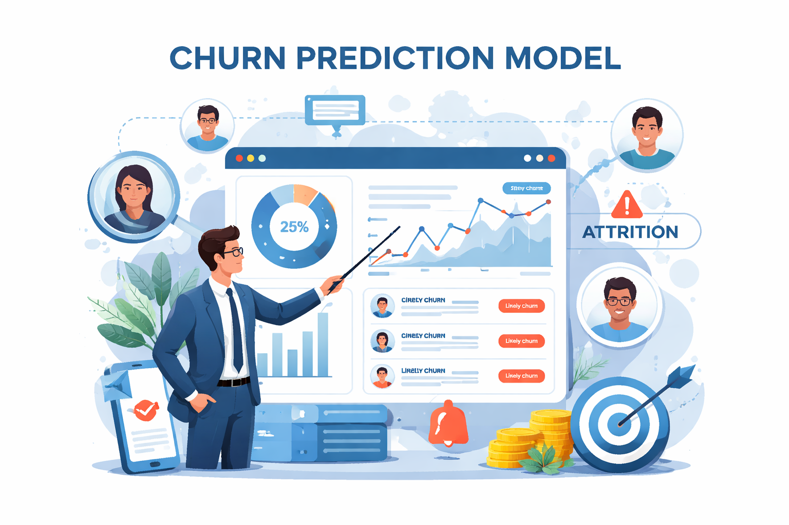
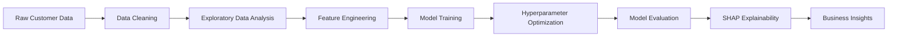

<h1 align="center">📊 Customer Churn Prediction </h1>

<p align="center">
An End-to-End Machine Learning Project for Predicting Customer Churn
</p>
<p align="center">
Using customer behavioral analytics to identify high-risk customers and support data-driven retention strategies.
</p>

<p align="center">
  


</p>

---

<p align="center">

</p>

---

#  Project Overview

Customer churn represents a significant challenge for businesses that rely on long-term customer relationships. Losing customers leads to revenue loss and higher marketing costs for acquiring new ones. This project develops a **machine learning model that predicts which customers are likely to churn**, allowing companies to proactively intervene with targeted retention strategies.

The project demonstrates a **complete end-to-end data science workflow**, from exploratory analysis to model explainability and business insights.

---

#  Business Problem

Customer churn occurs when customers stop using a company's products or services.

Businesses aim to answer key questions such as:

* Which customers are most likely to churn?
* What factors drive churn behavior?
* How can companies reduce customer attrition?

By predicting churn risk, organizations can **target high-risk customers with personalized retention strategies**.


#  Dataset

The dataset contains customer-related information collected from an e-commerce platform. These features capture customer demographics, behavioral patterns, satisfaction levels, and loyalty indicators that help predict customer churn.

| Category | Description | Related Features |
|----------|-------------|------------------|
| **Demographics** | Customer profile information  | `Gender`, `CityTier`, `MaritalStatus`, `PreferredLoginDevice` |
| **Behavioral Data** | Engagement and purchase patterns| `OrderCount`, `PreferredPaymentMode`, `NumberOfAddress`, `OrderAmountHikeFromLastYear`, `PreferredOrderCategory` |
| **Satisfaction Metrics** | Customer feedback and ratings | `SatisfactionScore`, `Complain`, `WarehouseToHome` |
| **Loyalty Indicators** |  Customer tenure and loyalty status | `Tenure`, `NumberOfDeviceRegistered`, `DaySinceLastOrder`, `CouponUsed`, `CashbackAmount` |

`Churn` → Indicates whether a customer has discontinued using the service.

---


#  Machine Learning Pipeline



---

#   Model Development

Two gradient boosting algorithms were implemented:

* **XGBoost**
* **CatBoost**

These models are widely used for structured tabular data and often provide strong predictive performance.

Hyperparameter tuning was performed using **Hyperopt** to optimize model performance.


---


#  Model Performance

| Model               | Accuracy | ROC-AUC |
| ------------------- | -------- | ------- |
| Logistic Regression | 0.82     | 0.85    |
| XGBoost             | 0.88     | 0.91    |
| CatBoost            | 0.89     | 0.92    |

The gradient boosting models demonstrated strong performance in identifying customers likely to churn.

---

#  Model Explainability

To understand the drivers behind churn predictions, this project uses **SHAP (SHapley Additive Explanations)**.

SHAP helps to:

* Identify the most influential features
* Interpret individual predictions
* Improve model transparency

This allows stakeholders to understand **why customers are predicted to churn**.

---

# 💡 Key Insights

Key patterns identified in the analysis include:

* Customers with **lower satisfaction scores** show higher churn probability
* **Short customer tenure** strongly correlates with churn
* Reduced engagement and purchasing activity increase churn risk

These insights help businesses design **data-driven customer retention strategies**.

---

#  Project Structure

```
customer-churn-prediction
│
├── data
│   └── dataset.csv
│
├── notebooks
│   └── customer_churn_prediction.ipynb
│
├── images
│   └── churn-banner.png
│
├── outputs
│   └── high_risk_churn_customers.csv
│
├── requirements.txt
│
└── README.md
```

# ▶️ How to Run the Project

Clone the repository

```
git clone https://github.com/yourusername/customer-churn-prediction.git
```

Install dependencies

```
pip install -r requirements.txt
```

Run the notebook

```
jupyter notebook
```

---

# 🔮 Future Improvements

Possible improvements include:

* Handling class imbalance using SMOTE
* Implementing cross-validation
* Testing additional machine learning models
* Deploying the model as a web application
* Building an interactive analytics dashboard

---

# Author

**Anne Fernando**

This project was completed as part of a University Artificial Intelligence for Communication and Marketing assignment and is shared as part of my data science portfolio on GitHub.

GitHub: https://github.com/Annefern96
